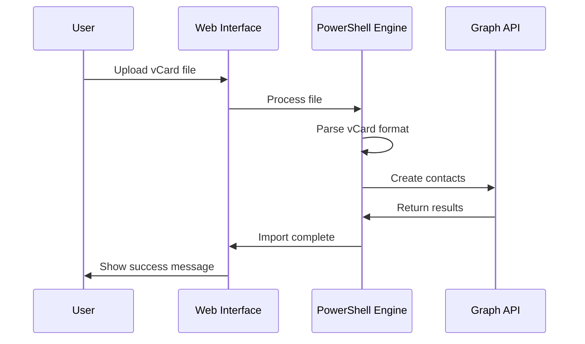

# Contributing to Import-OutlookContact

Thank you for your interest in contributing to Import-OutlookContact! This guide will help you get started and ensure smooth collaboration while maintaining our high-quality standards.

---

## Getting Started

### Prerequisites

Before you begin, ensure you have the following installed:

- **PowerShell 7.0+** ([Install Guide](https://docs.microsoft.com/en-us/powershell/scripting/install/installing-powershell))
- **Visual Studio Code** with PowerShell extension
- **Git** for version control
- **Azure CLI** (for Azure-related development)

### Initial Setup

1. **Fork and Clone**

   ```bash
   git clone https://github.com/YOUR-USERNAME/Import-OutlookContact.git
   cd Import-OutlookContact
   ```

2. **Install Dependencies**

   ```powershell
   # Install required PowerShell modules
   Install-Module Microsoft.Graph -Scope CurrentUser
   Install-Module UniversalDashboard.Community -Scope CurrentUser
   Install-Module Pester -Scope CurrentUser

   # Verify prerequisites
   pwsh .\scripts\Test-Prerequisites.ps1
   ```

3. **Setup Development Environment**

   ```powershell
   # Initialize development configuration
   pwsh .\scripts\Setup-DevEnvironment.ps1

   # Test your setup
   pwsh .\scripts\Test-DevelopmentSetup.ps1
   ```

---

## Development Workflow

### Branch Strategy

- **`main`** - Production-ready code
- **`develop`** - Integration branch for features
- **`feature/feature-name`** - New features
- **`fix/issue-description`** - Bug fixes
- **`docs/documentation-update`** - Documentation changes

### Branch Naming Convention

```bash
# Features
feature/backup-restore-ui
feature/duplicate-detection-enhancement
feature/csv-import-validation

# Bug fixes
fix/memory-leak-large-imports
fix/authentication-token-refresh
fix/ui-validation-error

# Documentation
docs/api-reference-update
docs/deployment-guide-enhancement

# Hotfixes
hotfix/security-vulnerability-patch
```

### Commit Message Format

We follow [Conventional Commits](https://www.conventionalcommits.org/) specification:

```
<type>[optional scope]: <description>

[optional body]

[optional footer(s)]
```

**Types:**

- `feat`: New feature
- `fix`: Bug fix
- `docs`: Documentation changes
- `style`: Code style changes (formatting, etc.)
- `refactor`: Code refactoring
- `test`: Adding or updating tests
- `chore`: Maintenance tasks

**Examples:**

```bash
feat(import): add vCard multi-contact support
fix(backup): resolve encryption key generation issue
docs(api): update PowerShell cmdlet reference
test(duplicate): add edge case tests for phone matching
```

---

## Coding Standards

### PowerShell Style Guide

#### Function Structure

```powershell
function Verb-Noun {
    [CmdletBinding()]
    param(
        [Parameter(Mandatory = $true)]
        [string]$RequiredParameter,

        [Parameter(Mandatory = $false)]
        [string]$OptionalParameter = "DefaultValue"
    )

    begin {
        Write-Verbose "Starting $($MyInvocation.MyCommand.Name)"
        # Initialization code
    }

    process {
        try {
            # Main logic here
            Write-Information "Processing $RequiredParameter"
        }
        catch {
            Write-Error "Error in $($MyInvocation.MyCommand.Name): $($_.Exception.Message)"
            throw
        }
    }

    end {
        Write-Verbose "Completed $($MyInvocation.MyCommand.Name)"
    }
}
```

#### Variable Naming

- Use **PascalCase** for functions and parameters
- Use **camelCase** for local variables
- Use descriptive names: `$userEmailAddress` not `$email`
- Avoid abbreviations unless widely understood

#### Error Handling

```powershell
# Always use try-catch for external API calls
try {
    $result = Invoke-MgGraphRequest -Uri $uri -Method POST -Body $body
}
catch {
    Write-Error "Failed to create contact: $($_.Exception.Message)"
    Write-Debug "Full error: $($_ | ConvertTo-Json -Depth 3)"
    throw
}
```

### Documentation Standards

#### Inline Comments

```powershell
# Use comments to explain WHY, not WHAT
$batchSize = 100  # Optimal batch size based on Graph API rate limits

# Complex logic should be documented
# This loop handles the edge case where contacts have no email
# but need to be matched by phone number for duplicate detection
foreach ($contact in $contactsWithoutEmail) {
    # Implementation...
}
```

#### Function Documentation

```powershell
<#
.SYNOPSIS
    Imports contacts from a vCard file with duplicate detection.

.DESCRIPTION
    This function processes vCard (.vcf) files containing one or more contacts,
    performs duplicate detection based on configurable criteria, and imports
    contacts to the specified Outlook folder.

.PARAMETER FilePath
    Path to the vCard file to import.

.PARAMETER UserEmail
    Email address of the target user's mailbox.

.PARAMETER TargetFolder
    Name of the contact folder (e.g., "Vendors", "Clients").

.PARAMETER DuplicateAction
    Action to take when duplicates are found: Skip, Merge, or Overwrite.

.EXAMPLE
    Import-VCardContacts -FilePath ".\contacts.vcf" -UserEmail "user@domain.com" -TargetFolder "Vendors" -DuplicateAction "Merge"

.NOTES
    Requires Microsoft.Graph module and appropriate permissions.
#>
```

---

## Testing Requirements

### Test Categories

1. **Unit Tests** - Individual function testing
2. **Integration Tests** - Component interaction testing
3. **End-to-End Tests** - Complete workflow validation
4. **Performance Tests** - Load and stress testing

### Running Tests

```powershell
# Run all tests
pwsh .\scripts\Invoke-AllTests.ps1

# Run specific test category
pwsh .\scripts\Invoke-AllTests.ps1 -Category "Unit"

# Run with coverage report
pwsh .\scripts\Invoke-AllTests.ps1 -Coverage -OutputPath ".\test-results\"

# Run performance tests
pwsh .\scripts\Invoke-PerformanceTests.ps1 -Detailed
```

### Writing Tests

#### Unit Test Example

```powershell
Describe "Import-VCardContacts" {
    BeforeAll {
        # Setup test data
        $testVCardPath = ".\test\data\sample-contacts.vcf"
        $testUserEmail = "testuser@domain.com"
    }

    Context "Valid vCard File" {
        It "Should import contacts successfully" {
            $result = Import-VCardContacts -FilePath $testVCardPath -UserEmail $testUserEmail

            $result.Success | Should -Be $true
            $result.ImportedCount | Should -BeGreaterThan 0
        }

        It "Should handle duplicate detection" {
            $result = Import-VCardContacts -FilePath $testVCardPath -UserEmail $testUserEmail -DuplicateAction "Skip"

            $result.DuplicatesFound | Should -BeGreaterOrEqual 0
        }
    }

    Context "Invalid Input" {
        It "Should throw error for non-existent file" {
            { Import-VCardContacts -FilePath ".\nonexistent.vcf" -UserEmail $testUserEmail } | Should -Throw
        }
    }
}
```

### Test Data Management

- Use **anonymized test data** only
- Store test files in `.\test\data\` directory
- Clean up test data after tests complete
- Never use production data in tests

---

## Documentation Standards

### Documentation Types

1. **User Documentation** - End-user guides and tutorials
2. **Developer Documentation** - API references and technical guides
3. **Administrative Documentation** - Deployment and maintenance guides
4. **Compliance Documentation** - Security and privacy requirements

### Documentation Updates

When making changes, update relevant documentation:

```powershell
# New feature checklist
□ Update UI-Spec.md with new interface elements
□ Add feature description to Import-DataManagement.md
□ Update Testing-Validation.md with new test cases
□ Add PowerShell examples to API.md
□ Update Documentation-Index.md with new sections
```

### Diagrams and Visuals

- Use **Mermaid** for flowcharts and sequence diagrams
- Include **screenshots** for UI changes
- Create **wireframes** for new interface elements
- Update **architecture diagrams** for system changes

Example Mermaid diagram:



---

## Pull Request Process

### Before Submitting

1. **Run All Tests**

   ```powershell
   pwsh .\scripts\Invoke-AllTests.ps1 -Coverage
   ```

2. **Check Code Quality**

   ```powershell
   pwsh .\scripts\Invoke-CodeAnalysis.ps1 -Fix
   ```

3. **Update Documentation**

   - Verify all relevant docs are updated
   - Run spell check on documentation
   - Test documentation examples

4. **Security Review**
   ```powershell
   pwsh .\scripts\Test-SecurityCompliance.ps1
   ```

### Pull Request Template

When creating a PR, include:

```markdown
## Description

Brief description of changes and motivation.

## Type of Change

- [ ] Bug fix (non-breaking change that fixes an issue)
- [ ] New feature (non-breaking change that adds functionality)
- [ ] Breaking change (fix or feature that would cause existing functionality to not work as expected)
- [ ] Documentation update

## Testing

- [ ] Unit tests pass
- [ ] Integration tests pass
- [ ] Manual testing completed
- [ ] Performance impact assessed

## Documentation

- [ ] Code comments updated
- [ ] API documentation updated
- [ ] User documentation updated
- [ ] README.md updated (if needed)

## Security & Privacy

- [ ] No secrets or PII in code
- [ ] Security implications assessed
- [ ] Privacy impact evaluated
- [ ] GDPR compliance maintained

## Screenshots (if applicable)

[Include screenshots for UI changes]

## Checklist

- [ ] Self-review completed
- [ ] Code follows style guidelines
- [ ] Tests added/updated
- [ ] Documentation updated
- [ ] No merge conflicts
```

### Review Process

1. **Automated Checks** - CI/CD pipeline runs tests and analysis
2. **Peer Review** - At least one reviewer required
3. **Security Review** - For changes affecting authentication or data handling
4. **Documentation Review** - For changes affecting user-facing features

---

## Security Guidelines

### Code Security

#### Secrets Management

```powershell
# ❌ Never do this
$clientSecret = "super-secret-value"

# ✅ Use environment variables
$clientSecret = $env:AZURE_CLIENT_SECRET
if (-not $clientSecret) {
    throw "AZURE_CLIENT_SECRET environment variable not set"
}
```

#### Input Validation

```powershell
# Always validate user input
function Import-ContactsFromFile {
    param(
        [Parameter(Mandatory = $true)]
        [ValidateScript({
            if (-not (Test-Path $_)) {
                throw "File not found: $_"
            }
            if ($_ -notmatch '\.(csv|vcf)$') {
                throw "Unsupported file format. Use .csv or .vcf files."
            }
            return $true
        })]
        [string]$FilePath
    )
}
```

#### Error Messages

```powershell
# ❌ Don't expose internal details
catch {
    Write-Error "Database connection failed: Server=sql01;Database=contacts;User=sa"
}

# ✅ Generic error messages for users
catch {
    Write-Error "Unable to connect to data storage. Please check your configuration."
    Write-Debug "Detailed error: $($_.Exception.Message)"
}
```

### Data Privacy

- **Minimize Data Collection** - Only collect necessary contact information
- **Data Retention** - Implement automatic cleanup of old data
- **Audit Logging** - Log all access to personal data
- **User Consent** - Ensure proper consent for data processing

### Security Checklist

Before submitting code:

- [ ] No hardcoded secrets or credentials
- [ ] Input validation on all user inputs
- [ ] Proper error handling without information disclosure
- [ ] Audit logging for sensitive operations
- [ ] HTTPS/TLS for all external communications
- [ ] Principle of least privilege for permissions
- [ ] SQL injection protection (if applicable)
- [ ] XSS protection for web interfaces

---

## Performance Guidelines

### Optimization Best Practices

#### Batch Processing

```powershell
# Process contacts in batches to avoid memory issues
$batchSize = 100
for ($i = 0; $i -lt $contacts.Count; $i += $batchSize) {
    $batch = $contacts[$i..($i + $batchSize - 1)]
    Process-ContactBatch -Contacts $batch
}
```

#### Efficient Graph API Usage

```powershell
# Use batch requests for multiple operations
$batch = New-Object System.Collections.ArrayList

foreach ($contact in $contacts) {
    $request = @{
        id = [guid]::NewGuid().ToString()
        method = "POST"
        url = "/me/contacts"
        body = $contact
    }
    $null = $batch.Add($request)
}

$batchResult = Invoke-MgBatchRequest -Requests $batch
```

#### Memory Management

```powershell
# Dispose of large objects when done
try {
    $largeDataSet = Import-Csv $filePath
    Process-Data $largeDataSet
}
finally {
    $largeDataSet = $null
    [System.GC]::Collect()
}
```

### Performance Testing

```powershell
# Measure execution time
$stopwatch = [System.Diagnostics.Stopwatch]::StartNew()
Import-ContactsFromFile -FilePath $largeCsvFile
$stopwatch.Stop()
Write-Information "Import completed in $($stopwatch.ElapsedMilliseconds)ms"
```

---

## Accessibility Guidelines

### UI Development

- **Keyboard Navigation** - All UI elements must be accessible via keyboard
- **Screen Reader Support** - Use semantic HTML and ARIA labels
- **Color Contrast** - Maintain WCAG 2.1 AA contrast ratios
- **Font Sizes** - Support browser zoom up to 200%

### Testing Accessibility

```powershell
# Run accessibility tests
pwsh .\scripts\Test-Accessibility.ps1 -Detailed
```

---

## Communication Guidelines

### Issue Reporting

When reporting bugs or requesting features:

1. **Search existing issues** first
2. **Use issue templates** when available
3. **Provide detailed information**:
   - PowerShell version
   - Operating system
   - Steps to reproduce
   - Expected vs actual behavior
   - Screenshots (if applicable)

### Code Reviews

#### As a Reviewer

- Be constructive and respectful
- Focus on code quality, not personal preferences
- Suggest improvements with explanations
- Approve when code meets standards

#### As a Contributor

- Respond to feedback promptly
- Ask questions if feedback is unclear
- Make requested changes or discuss alternatives
- Thank reviewers for their time

---

## Release Process

### Version Numbering

We use [Semantic Versioning](https://semver.org/):

- **MAJOR** version for incompatible changes
- **MINOR** version for backward-compatible features
- **PATCH** version for backward-compatible bug fixes

### Release Checklist

- [ ] All tests pass
- [ ] Documentation updated
- [ ] CHANGELOG.md updated
- [ ] Version numbers updated
- [ ] Security review completed
- [ ] Performance benchmarks verified
- [ ] Deployment tested in staging environment

---

## Getting Help

### Resources

- **Documentation**: Start with [Documentation Index](/docs/Documentation-Index.md)
- **Examples**: Check `/examples` directory for sample code
- **Tests**: Review test files for usage examples
- **API Reference**: See [API.md](/docs/API.md) for detailed reference

### Contact

- **General Questions**: Open a GitHub issue with the `question` label
- **Bug Reports**: Use the bug report template
- **Security Issues**: See [SECURITY.md](SECURITY.md) for responsible disclosure
- **Feature Requests**: Use the feature request template

### Community Guidelines

- Be respectful and inclusive
- Help others learn and grow
- Share knowledge and best practices
- Follow the code of conduct

---

Thank you for contributing to Import-OutlookContact! Your efforts help make enterprise contact management more efficient and secure for everyone. 🚀
