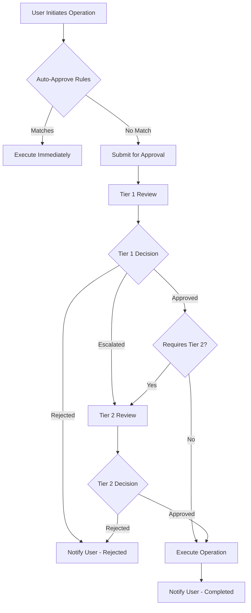

# Change Approval Workflow

This document describes the configurable change approval system for Import-OutlookContact, enabling organizations to implement governance controls over bulk contact operations.

## Overview

The change approval workflow provides multi-tier approval processes for sensitive contact operations, ensuring proper oversight and compliance with organizational policies.

---

## Approval System Configuration

### Workflow Configuration

Enable multi-stage approval for sensitive operations:

```json
{
  "ApprovalWorkflow": {
    "Enabled": true,
    "RequireApproval": ["BulkAdd", "BulkEdit", "BulkDelete"],
    "Approvers": {
      "Tier1": ["hr-managers@domain.com", "it-admins@domain.com"],
      "Tier2": ["ciso@domain.com", "dpo@domain.com"]
    },
    "AutoApprove": {
      "MaxContacts": 10,
      "TrustedUsers": ["system-account@domain.com"]
    },
    "Notifications": {
      "PendingApproval": true,
      "ApprovalDecision": true,
      "ReminderDays": 2
    }
  }
}
```

### Approval Tiers

**Tier 1 Approvers:**

- Department managers
- IT administrators
- Team leads
- Delegate approvers

**Tier 2 Approvers:**

- Security officers (CISO)
- Data protection officers (DPO)
- Compliance managers
- C-level executives

**Auto-Approval Rules:**

- Operations under specified contact count
- Trusted system accounts
- Pre-approved operation types
- Emergency override conditions

---

## Approval Process Workflows

### End User Request Flow



### For End Users

**Submitting Requests:**

```powershell
# Submit bulk operation for approval
pwsh .\Import-OutlookContact.ps1 -Mode BulkAdd -CsvPath .\contacts.csv -RequestApproval

# Check approval status
pwsh .\scripts\Get-ApprovalStatus.ps1 -RequestId "REQ-2024-001"

# View request history
pwsh .\scripts\Get-MyApprovalRequests.ps1 -Status "Pending"
```

**Request Tracking:**

- Real-time status updates
- Email notifications for status changes
- Expected approval timeframes
- Escalation procedures

---

## Approver Interface

### For Approvers

**Review Pending Requests:**

```powershell
# Review pending approvals
pwsh .\scripts\Get-PendingApprovals.ps1 -AssignedTo $env:USER

# Get detailed request information
pwsh .\scripts\Get-ApprovalDetails.ps1 -RequestId "REQ-2024-001"
```

**Making Approval Decisions:**

```powershell
# Approve operation with comments
pwsh .\scripts\Approve-Request.ps1 -RequestId "REQ-2024-001" -Decision "Approved" -Comments "Verified with HR"

# Reject with reason
pwsh .\scripts\Approve-Request.ps1 -RequestId "REQ-2024-001" -Decision "Rejected" -Comments "Missing justification"

# Request additional information
pwsh .\scripts\Approve-Request.ps1 -RequestId "REQ-2024-001" -Decision "MoreInfo" -Comments "Need business justification"
```

### Approval Dashboard Features

**Web Interface Capabilities:**

- Dashboard view of pending requests
- Detailed operation preview
- Historical approval patterns
- Bulk approval operations
- Delegation management

**Decision Support:**

- Risk assessment indicators
- Historical similar operations
- Policy compliance checks
- Impact analysis
- Stakeholder input

---

## Approval Categories and Rules

### Operation Classification

**High-Risk Operations:**

- Bulk delete operations (>50% of contacts)
- Cross-organizational folder moves
- Executive contact modifications
- External contact additions

**Medium-Risk Operations:**

- Standard bulk additions (<100 contacts)
- Department-specific updates
- Contact field modifications
- Scheduled maintenance operations

**Low-Risk Operations:**

- Individual contact additions
- Contact field corrections
- Template updates
- Test operations

### Risk-Based Approval

**Risk Assessment Factors:**

- Number of contacts affected
- Sensitivity of data changes
- User role and permissions
- Operation timing and context
- Historical success rates

**Dynamic Approval Requirements:**

```json
{
  "riskBasedApprovals": {
    "lowRisk": {
      "approvers": 1,
      "tier": 1,
      "autoApprove": true
    },
    "mediumRisk": {
      "approvers": 1,
      "tier": 1,
      "autoApprove": false
    },
    "highRisk": {
      "approvers": 2,
      "tier": 2,
      "autoApprove": false
    }
  }
}
```

---

## Notification System

### Approval Notifications

**For Requestors:**

- Request submission confirmation
- Approval status updates
- Decision notifications with reasoning
- Completion notifications

**For Approvers:**

- New request notifications
- Reminder notifications (configurable)
- Escalation notifications
- Summary reports

**For Administrators:**

- Approval pattern analytics
- Policy compliance reports
- Bottleneck identification
- Performance metrics

### Email Templates

**Request Submission:**

```html
Subject: Contact Operation Approval Request - REQ-2024-001 Dear [Approver Name],
A new contact operation requires your approval: Operation: Bulk Add Contacts
Requested by: [User Name] Contact Count: [Number] Folders Affected: [Folder
List] Business Justification: [User Comments] [Approve] [Reject] [More Info]
[View Details] This request will expire in [X] days if not reviewed.
```

---

## Emergency Procedures

### Emergency Override

**Override Conditions:**

- Security incidents requiring immediate action
- Business continuity requirements
- System maintenance windows
- Regulatory compliance deadlines

**Override Process:**

```powershell
# Emergency override (requires elevated permissions)
pwsh .\scripts\Invoke-EmergencyOverride.ps1 -RequestId "REQ-2024-001" -Justification "Security Incident"

# Post-override review
pwsh .\scripts\New-OverrideReview.ps1 -OverrideId "OVR-2024-001"
```

**Audit Requirements:**

- Detailed justification documentation
- Post-incident review procedures
- Override authority validation
- Compliance impact assessment

---

## Approval Analytics

### Performance Metrics

**Key Performance Indicators:**

- Average approval time by tier
- Approval success rates
- Rejection reasons analysis
- Bottleneck identification
- User satisfaction scores

**Reporting Capabilities:**

```powershell
# Generate approval metrics report
pwsh .\scripts\Get-ApprovalMetrics.ps1 -Period "Monthly" -Format "PDF"

# Analyze approval patterns
pwsh .\scripts\Get-ApprovalPatterns.ps1 -Approver "manager@domain.com"
```

### Process Optimization

**Continuous Improvement:**

- Approval time optimization
- Rule refinement based on patterns
- Training needs identification
- System efficiency improvements

**Feedback Integration:**

- User experience surveys
- Approver feedback collection
- Process improvement suggestions
- Best practice sharing

---

## Compliance and Auditing

### Audit Trail

**Comprehensive Logging:**

- All approval decisions with timestamps
- Approver identity and role
- Decision reasoning and comments
- System-generated risk assessments
- Emergency overrides and justifications

**Audit Reporting:**

```powershell
# Generate compliance audit report
pwsh .\scripts\Get-ApprovalAudit.ps1 -StartDate "2024-01-01" -EndDate "2024-12-31"

# Export for external audit
pwsh .\scripts\Export-ApprovalLogs.ps1 -Format "SIEM" -Destination ".\audit\"
```

### Regulatory Compliance

**Standards Alignment:**

- SOX compliance for financial controls
- GDPR approval documentation
- HIPAA authorization requirements
- Industry-specific regulations

**Documentation Requirements:**

- Policy documentation
- Procedure manuals
- Training records
- Compliance certifications

---

## Integration with External Systems

### Workflow Integration

**ITSM Integration:**

- ServiceNow change management
- Jira approval workflows
- Azure DevOps work items
- Custom ticketing systems

**HR System Integration:**

- Manager hierarchy validation
- Delegation authority verification
- Organizational change impacts
- Employee lifecycle alignment

### API Integration

**External Approval Systems:**

```powershell
# Configure external approval system
pwsh .\scripts\Set-ExternalApproval.ps1 -System "ServiceNow" -Endpoint "https://company.service-now.com/api"

# Sync approval status
pwsh .\scripts\Sync-ApprovalStatus.ps1 -RequestId "REQ-2024-001"
```

**Automation Capabilities:**

- Workflow orchestration
- Decision automation
- Status synchronization
- Escalation management
