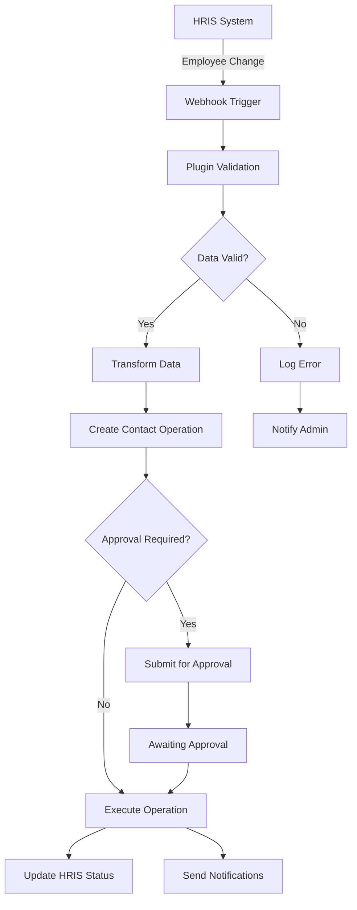
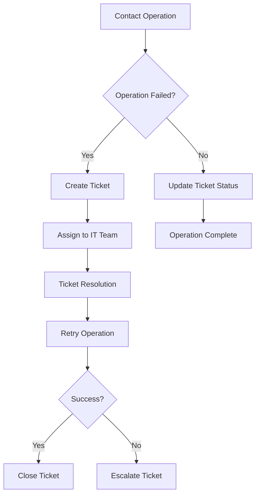

# Plugin Architecture and Integrations

This document details the extensible plugin system and integration capabilities of Import-OutlookContact, enabling seamless connectivity with HRIS, ticketing systems, and automation platforms.

## Overview

The plugin architecture provides a flexible framework for extending Import-OutlookContact functionality through custom integrations, workflow automation, and data source connectivity.

---

## Extension API

### Core API Interface

The application provides both RESTful API and PowerShell module interfaces for external integrations:

```powershell
# Load extension API
Import-Module .\modules\ImportOutlookContact.Extensions

# Register custom plugin
Register-IOCPlugin -Name "HRISSync" -Path ".\plugins\HRIS\HRISSync.ps1"

# Configure webhook endpoint
Set-IOCWebhook -Url "https://your-system.com/webhook" -Events @("ContactAdded","ContactUpdated")
```

### API Endpoints

**Core Endpoints:**

- `GET /api/contacts` - Retrieve contact data
- `POST /api/contacts` - Create new contacts
- `PUT /api/contacts/{id}` - Update existing contacts
- `DELETE /api/contacts/{id}` - Remove contacts
- `GET /api/operations` - List operations history
- `POST /api/operations` - Execute bulk operations

**Plugin Management:**

- `GET /api/plugins` - List installed plugins
- `POST /api/plugins` - Install new plugin
- `PUT /api/plugins/{id}` - Update plugin configuration
- `DELETE /api/plugins/{id}` - Uninstall plugin

---

## Pre-built Integrations

### HRIS Systems

**BambooHR Integration:**

- Sync employee data and organizational changes
- Automated new hire contact creation
- Department restructuring updates
- Employee lifecycle management

**Workday Integration:**

- Import new hires and department moves
- Position change notifications
- Organizational hierarchy updates
- Custom field synchronization

**ADP Integration:**

- Employee lifecycle management integration
- Payroll-driven contact updates
- Benefits enrollment contact sharing
- Time-off manager notifications

**Custom HRIS Template:**

- Generic HRIS connector framework
- Configurable field mappings
- Authentication templates
- Data transformation utilities

### Ticketing Systems

**ServiceNow Integration:**

- Create incidents for failed operations
- Sync IT tickets with contact operations
- Change management workflow integration
- Automated ticket updates

**Jira Integration:**

- Create tasks for contact data cleanup
- Validation issue tracking
- Project-based contact management
- Sprint planning integration

**Azure DevOps Integration:**

- Change management workflows
- Work item integration
- Release management coordination
- Compliance tracking

### Automation Platforms

**Power Automate Integration:**

- Trigger flows on contact changes
- Approval workflow automation
- Email notification customization
- SharePoint integration

**Zapier Integration:**

- Connect to 3000+ apps and services
- No-code automation workflows
- Trigger-based integrations
- Multi-step automation chains

**Microsoft Logic Apps:**

- Enterprise workflow automation
- Azure service integration
- B2B connector support
- Advanced error handling

---

## Plugin Development

### Creating Custom Plugins

```powershell
# Create new plugin scaffold
pwsh .\scripts\New-Plugin.ps1 -Name "CustomSystem" -Type "HRIS"

# Test plugin locally
pwsh .\scripts\Test-Plugin.ps1 -Plugin "CustomSystem"

# Deploy plugin to production
pwsh .\admin\Deploy-Plugin.ps1 -Plugin "CustomSystem" -Environment "Production"
```

### Plugin Structure

**Required Files:**

```
/plugins/CustomSystem/
├── manifest.json          # Plugin metadata
├── plugin.ps1            # Main plugin logic
├── config.json           # Configuration template
├── tests/
│   └── plugin.tests.ps1   # Unit tests
└── docs/
    └── README.md          # Plugin documentation
```

**Manifest Example:**

```json
{
  "name": "CustomSystem",
  "version": "1.0.0",
  "description": "Integration with Custom HRIS",
  "author": "Your Organization",
  "type": "HRIS",
  "events": ["ContactAdded", "ContactUpdated", "ContactDeleted"],
  "permissions": ["Contacts.Read", "Contacts.Write"],
  "dependencies": ["Microsoft.Graph"],
  "configSchema": "config-schema.json"
}
```

### Plugin Capabilities

**Event Hooks:**

- Pre/post-processing hooks for all operations
- Custom validation rules and business logic
- External data source integration
- Custom notification channels
- Audit log extensions

**Data Access:**

- Read/write contact data
- Access audit logs
- Configuration management
- User preference access
- System health metrics

**Integration Points:**

- Webhook endpoints
- Scheduled jobs
- Real-time event processing
- Batch operation support
- Error handling and retry logic

---

## Integration Workflows

### HRIS Synchronization Workflow



### Ticketing Integration Workflow



---

## Configuration Management

### Plugin Configuration

```json
{
  "plugins": {
    "BambooHR": {
      "enabled": true,
      "apiKey": "${BAMBOO_API_KEY}",
      "subdomain": "yourcompany",
      "syncInterval": "1h",
      "fieldMappings": {
        "firstName": "givenName",
        "lastName": "surname",
        "workEmail": "emailAddresses[0].address"
      }
    },
    "ServiceNow": {
      "enabled": true,
      "instance": "yourcompany.service-now.com",
      "username": "${SERVICENOW_USER}",
      "password": "${SERVICENOW_PASS}",
      "assignmentGroup": "IT Support"
    }
  }
}
```

### Environment Variables

**Security Configuration:**

- `BAMBOO_API_KEY` - BambooHR API authentication
- `SERVICENOW_USER` - ServiceNow username
- `SERVICENOW_PASS` - ServiceNow password
- `JIRA_TOKEN` - Jira API token
- `WEBHOOK_SECRET` - Webhook validation secret

---

## Testing and Validation

### Plugin Testing Framework

```powershell
# Run plugin unit tests
pwsh .\scripts\Test-Plugin.ps1 -Plugin "BambooHR" -TestSuite "Unit"

# Integration testing
pwsh .\scripts\Test-Plugin.ps1 -Plugin "BambooHR" -TestSuite "Integration"

# Performance testing
pwsh .\scripts\Test-Plugin.ps1 -Plugin "BambooHR" -TestSuite "Performance"
```

### Test Coverage Requirements

**Required Test Categories:**

- Unit tests for all plugin functions
- Integration tests with external systems
- Error handling and edge cases
- Performance and load testing
- Security and authentication testing

**Test Automation:**

- Continuous integration testing
- Automated regression testing
- Mock service integration
- Test data management
- Result reporting and analysis

---

## Security Considerations

### Plugin Security Model

**Isolation:**

- Plugins run in separate PowerShell runspaces
- Limited access to system resources
- Permission-based API access
- Input validation and sanitization

**Authentication:**

- OAuth 2.0 for external services
- API key management
- Certificate-based authentication
- Token refresh automation

**Data Protection:**

- Encrypted configuration storage
- Secure credential management
- Audit trail for plugin operations
- Data classification enforcement

### Security Best Practices

**Development Guidelines:**

- Input validation and sanitization
- Secure coding practices
- Dependency vulnerability scanning
- Code signing requirements

**Deployment Security:**

- Plugin verification and validation
- Digital signature requirements
- Sandboxed execution environment
- Runtime permission enforcement

---

## Monitoring and Management

### Plugin Monitoring

```powershell
# Monitor plugin performance
pwsh .\admin\Get-PluginMetrics.ps1 -Plugin "BambooHR"

# Check plugin health
pwsh .\admin\Test-PluginHealth.ps1 -All

# Plugin error analysis
pwsh .\admin\Get-PluginErrors.ps1 -TimeRange "LastWeek"
```

### Performance Metrics

**Key Metrics:**

- Plugin execution time
- API call success rates
- Error frequency and patterns
- Resource utilization
- Integration latency

**Alerting:**

- Plugin failure notifications
- Performance threshold alerts
- Security violation warnings
- Capacity planning alerts

---

## Plugin Marketplace

### Plugin Distribution

**Plugin Repository:**

- Centralized plugin catalog
- Version management
- Dependency tracking
- Security validation

**Installation Process:**

- Automated plugin discovery
- Dependency resolution
- Configuration validation
- Rollback capabilities

### Community Contributions

**Open Source Plugins:**

- Community-developed integrations
- Code review process
- Security validation
- Documentation requirements

**Commercial Plugins:**

- Vendor-supported integrations
- Professional support options
- Enterprise feature sets
- SLA guarantees
