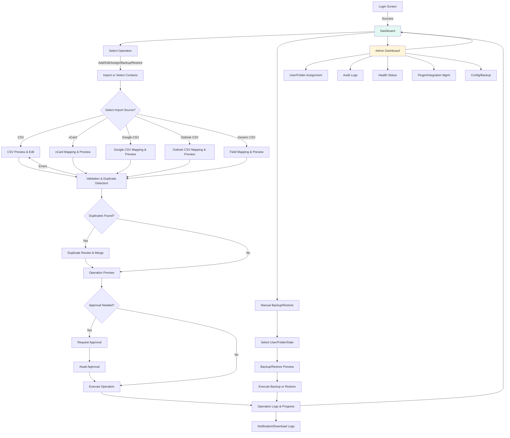

# UI/UX Specification — Import-OutlookContact

This document details the complete user interface, experience, and feature requirements for Import-OutlookContact. It is intended for developers, designers, and contributors, and includes: prioritized features, user flows, wireframes, backup/restore, advanced import, duplicate management, custom folders, and admin functionality.

---

## Prioritized UI Features Table

| Priority | Feature Category        | Description / Capabilities                                                                                                                                         |
| -------- | ----------------------- | ------------------------------------------------------------------------------------------------------------------------------------------------------------------ |
| High     | Authentication & Home   | Secure login (Microsoft Authenticator/passkey), dashboard with recent activity, health alerts, role-based navigation                                               |
| High     | CSV & Contact Import    | Upload/drag-and-drop CSV, vCard, Google/Outlook CSV. Template download, table/grid view, inline editing (optional), validation, add/remove rows, export edited CSV |
| High     | Field Mapping           | Map imported fields (from vCard, Google, Outlook, generic CSV) to Outlook contact properties; custom mapping UI; save mapping profiles                             |
| High     | Operations Wizard       | Step-by-step workflow for all core actions (add, edit, bulk assign, backup, restore, merge duplicates), preview/validation, approval step, confirmation            |
| High     | Backup & Restore        | Automatic backup before any change; manual backup/restore options; restore with preview; export/restore by user, folder, or all contacts                           |
| High     | Flexible Duplicate Mgmt | Duplicate detection by Email, Phone, or both; handle contacts without email; UI for reviewing and merging duplicates; merge report                                 |
| High     | Validation & Preview    | Show planned changes, highlight errors/warnings/conflicts, review old/new values, approval summary                                                                 |
| High     | Notifications & Logs    | Real-time progress bar, operation logs (inline and downloadable), success/error/warning pop-ups, notification summaries                                            |
| High     | Custom Folders Mgmt     | Support "Vendors", "Contractors", "Clients" or any admin-defined folders per user; assign by user/group/CSV; manage contacts as in org folders                     |
| Medium   | Accessibility           | Keyboard navigation, ARIA labels, high-contrast/theme selection, screen reader support, font scaling                                                               |
| Medium   | User Personalization    | Theme/language selector, preference management, dashboard, exportable usage analytics and change history                                                           |
| Medium   | Help & Support          | Contextual tooltips, quick start guide, feedback/bug submission (with logs/screenshots), help links                                                                |
| Medium   | Admin Dashboard         | User and approval management, operation analytics, health status, audit logs, compliance reports, security tools                                                   |
| Medium   | Undo/Redo Support       | Undo/redo for data edits and operations                                                                                                                            |
| Low      | Plugin/Integration Mgr  | Plugin enable/disable, endpoint config, bulk automation scheduling, API key/token management                                                                       |

---

## User Flow Diagram



---

## Wireframe Sketches

### Main Dashboard (After Login)

```
+-------------------------------------------------------------------------------------+
| Logo   | [Home] [Add/Edit Contacts] [Admin] [Backup/Restore] [Help] [Profile/User]  |
+-------------------------------------------------------------------------------------+
|  Welcome, <User>                                                | [Logout]         |
|-------------------------------------------------------------------------------------|
| Recent Operations: | [View All Logs]                                               |
|  - 08/04: Restore from backup (Previewed, Success)  [Details]                      |
|  - 08/04: Bulk add to Contractors (Success)      [Details]                         |
|-------------------------------------------------------------------------------------|
| Quick Actions:                                                                      |
| [Import Contacts] [Start Wizard] [Backup Now] [Download Template] [Preferences]     |
+-------------------------------------------------------------------------------------+
| System Health:  ✓ API Connected   ✓ Last Sync: 2h ago   | [Details/Health]         |
+-------------------------------------------------------------------------------------+
```

### Contact Import & Preview Screen

```
+------------------------------------------------------------------------------+
| Import Contacts: [vCard] [Google CSV] [Outlook CSV] [Generic CSV]            |
+------------------------------------------------------------------------------+
| [Drag file here] or [Browse Files]  | Detected Type: vCard (.vcf)            |
+------------------------------------------------------------------------------+
| Field Mapping (auto-detected, editable):                                     |
| CSV/Import Field   | Outlook Field           | [Mapping Selector]             |
|--------------------|------------------------|-------------------------------|
| FN (Full Name)     | givenName + surname    | [Auto]                        |
| EMAIL              | emailAddresses[0]      | [Select]                      |
| TEL                | businessPhones[0]      | [Select]                      |
| ORG                | companyName            | [Select]                      |
| TITLE              | jobTitle               | [Select]                      |
+------------------------------------------------------------------------------+
| Preview/Edit Table:  [Edit Rows] [Bulk Edit] [Validate] [Remove Selected]     |
| FirstName | LastName | Email         | Phone      | Folder   | Job Title      |
|-----------|----------|---------------|------------|----------|----------------|
| Alice     | Smith    | alice@ex.com  | 1234567890 | Clients  | Analyst        |
| ...       | ...      | ...           | ...        | ...      | ...            |
+------------------------------------------------------------------------------+
| [Continue] [Back] [Save as CSV]                                               |
+------------------------------------------------------------------------------+
```

### Backup and Restore Dialog

```
+----------------------------------------------------------------------------+
| [Backup Contacts] [Restore Contacts] [View Backups]                        |
+----------------------------------------------------------------------------+
| Select User: [Dropdown/Search]       Select Folder(s): [All | Multi-select]|
| Action: (o) Full Backup  (o) Folder Only  (o) Manual Restore               |
| Date/Time: [Select from backups]     [Preview] [Restore/Backup Now]        |
+----------------------------------------------------------------------------+
| Preview:                                                                  |
| - Contacts to be included/excluded                                         |
| - Conflicts/differences                                                    |
| - Estimated total entries                                                  |
+----------------------------------------------------------------------------+
| [Confirm & Run] [Cancel]                                                   |
+----------------------------------------------------------------------------+
```

### Duplicate Detection and Merge UI

```
+----------------------------------------------------------------------------+
| Duplicate Detection                                                        |
+----------------------------------------------------------------------------+
| Match Criteria: [Email] [Phone] [Both] [Custom Field]                      |
| [Scan for Duplicates]                                                      |
+----------------------------------------------------------------------------+
| Duplicates Found:                                                          |
| Name      | Email           | Phone       | Folder      | Merge Action     |
|-----------|-----------------|-------------|-------------|------------------|
| Bob Jones | bob@x.com       | 555-1234    | Org1/Clients| [Keep New/Old]   |
|           | bob.alt@x.com   | 555-1234    | Contractors | [Merge]          |
| ...       | ...             | ...         | ...         | ...              |
+----------------------------------------------------------------------------+
| [Auto-Merge All] [Manual Merge] [Skip]                                     |
| Merge Report:                                                              |
| - 3 merged, 2 skipped, 1 updated                                           |
+----------------------------------------------------------------------------+
| [Download Report] [Finish]                                                 |
+----------------------------------------------------------------------------+
```

### Folder Assignment UI (Admin)

```
+----------------------------------------------------------------------------+
| Folder Assignment                                                          |
+----------------------------------------------------------------------------+
| Users/Groups: [Select/Import CSV]                                          |
| Folders: [Vendors] [Contractors] [Clients] [Custom:________]               |
| Assign:                                                                    |
| - HR: Vendors, Contractors                                                 |
| - PM: Clients, Contractors                                                 |
| - All: Contractors                                                         |
+----------------------------------------------------------------------------+
| [Apply Assignment] [Preview Folder Creation]                               |
+----------------------------------------------------------------------------+
| Batch Result:                                                              |
| - 55 users updated, 4 errors, see details                                  |
+----------------------------------------------------------------------------+
```

---

## Feature Details

### 1. Backup and Restore of User Contact Lists

#### Automatic Backup Before Change

- Before any bulk or individual change to a user's contacts, the app creates a full backup (export) of the user's current contact list (including all custom folders)
- The backup is stored securely with a timestamp and user identifier
- Backup files are encrypted and stored with proper access controls

#### Manual Backup (No Change)

- Users and admins can trigger a backup of any contact list (including specific folders or all folders) at any time
- Used for point-in-time archiving, migration, or compliance
- Supports selective backup by user, folder, or date range

#### Restore Functionality

- Admins can restore any user's contact list (or a specific folder) from a previous backup
- Full or partial restore with operation preview before restore
- Conflict resolution for existing contacts during restore

### 2. Flexible Duplicate Matching and Merging

#### Switch Matching Criteria

- Allow users/admins to choose the field(s) used for duplicate detection and merge operations:
  - Email (default)
  - Phone number
  - Both (Email and Phone)
  - Option to add future custom fields

#### Handle Contacts Without Email

- When a contact lacks an email address, fallback to phone number (or other chosen fields) for duplicate detection
- Support updates and merges for contacts identified by alternate fields

#### Merge UI and Reporting

- UI for reviewing detected duplicates and customizing merge behavior
- Summary of which records were merged, updated, or skipped
- Detailed merge report with before/after comparison

### 3. Additional Folders for Non-Org Contacts

#### Create and Manage Extra Folders

- Beyond Org1/Org2/Org3, support custom folders such as "Vendors", "Contractors", and "Clients"
- Folders are managed per user with admin oversight

#### User/Folder Assignment

- Allow admins (and possibly users) to specify which folders are created for which users
- Assign folders based on department, group, or manually
- Example: HR gets "Vendors", Project Managers get "Clients", all get "Contractors"

#### Bulk Folder Assignment

- Support batch assignment of folders via CSV or admin UI
- Mass folder creation and assignment operations

#### Contact Management in Custom Folders

- All app functionality (add, edit, merge, backup, restore) extends to these folders
- Folder-specific permissions and access controls

### 4. iPhone Contact List Import

#### Overview

- Users can import their iPhone contact list by uploading a vCard (.vcf) file exported from iOS
- The app parses and maps iPhone contact fields to the required CSV format
- Allows for seamless onboarding or migration

#### Import Source

- Support for iPhone's vCard (.vcf) file export (standard format for exporting contacts from iOS via iCloud or AirDrop)
- Option to drag-and-drop, browse, or paste a `.vcf` file

#### Field Mapping

- Automatically parse and map iPhone vCard fields (First Name, Last Name, Phone, Email, Company, Job Title, etc.) to the app's standard CSV columns
- Display a field mapping table for manual overrides if needed

#### Preview and Edit

- Show a table/grid preview of the imported contacts
- Allow users to edit, remove, or add entries before saving/exporting as CSV or continuing to import

#### Export

- Save the mapped contact list as a CSV matching the app's requirements
- Option to directly proceed to bulk add/edit operations within the app

#### Error Handling

- Highlight and report any contacts missing key fields (such as no name or phone/email)
- Warn about duplicate contacts within the imported vCard or against existing Outlook/CSV entries

#### UI Additions

- `Import from iPhone` button or menu option on the dashboard and operation wizard
- Field mapping dialog specific for vCard import
- Validation results displayed after parsing the vCard file

### 5. Supported Contact Import File Types

#### 1. vCard (.vcf) Import

- Compatible with iPhone, Android, Mac, Outlook, and most CRMs
- Supports multi-contact vCard files
- Automatic and manual field mapping

#### 2. Google Contacts CSV Import

- Accepts CSV files exported from Google Contacts (Gmail/Workspace)
- Detects Google-specific columns and maps to app's standard CSV
- Preview and edit before import

#### 3. Outlook CSV Import

- Accepts CSV files exported from Outlook Desktop, Web, or M365 People
- Handles both "Windows CSV" and "Outlook CSV" formats
- Preview and map columns before import

#### 4. Generic CSV Import

- Accepts any CSV with headers
- User selects which columns map to required fields (First Name, Last Name, Email, Phone, Company, Job Title, etc)
- Allows saving mapping profiles for reuse

#### UI Additions

- "Import Contacts" dialog allows selecting file type/source (vCard, Google CSV, Outlook CSV, Generic CSV)
- After selecting/importing, field mapping and preview/edit screens are shown as with iPhone import

---

## Detailed UI Workflows

### Contact Import Workflow

1. **Import Selection**: User selects import type from dashboard or wizard
2. **File Upload**: Drag-and-drop or browse for file
3. **Auto-Detection**: System detects file type and format
4. **Field Mapping**: Show mapping interface with auto-detected fields
5. **Preview Table**: Editable grid showing imported contacts
6. **Validation**: Check for required fields, duplicates, errors
7. **Duplicate Handling**: If duplicates found, show merge interface
8. **Operation Preview**: Show what changes will be made
9. **Approval**: If required, request approval for operation
10. **Execution**: Perform the import operation
11. **Results**: Show success/error summary and logs

### Backup and Restore Workflow

#### Backup Process

1. **Backup Trigger**: Automatic (before changes) or manual
2. **Selection**: Choose user, folders, backup type
3. **Preview**: Show what will be backed up
4. **Execution**: Create encrypted backup with timestamp
5. **Verification**: Validate backup integrity
6. **Notification**: Confirm backup completion

#### Restore Process

1. **Restore Selection**: Choose user and backup date/time
2. **Backup Browse**: Show available backups with metadata
3. **Preview**: Show what will be restored and conflicts
4. **Conflict Resolution**: Handle existing contact conflicts
5. **Confirmation**: Final approval before restore
6. **Execution**: Restore contacts from backup
7. **Verification**: Validate restore success

### Duplicate Management Workflow

1. **Detection Criteria**: Select matching fields (email, phone, both)
2. **Scan Execution**: Search for potential duplicates
3. **Results Display**: Show duplicate pairs with details
4. **Review Interface**: Allow manual review of each duplicate
5. **Merge Options**: Choose merge strategy for each pair
6. **Batch Operations**: Apply merge rules to all duplicates
7. **Execution**: Perform merge operations
8. **Report Generation**: Create detailed merge report

---

## Accessibility Requirements

### WCAG 2.1 AA Compliance

- **Keyboard Navigation**: All functions accessible via keyboard
- **Screen Reader Support**: Proper ARIA labels and semantic HTML
- **Color Contrast**: Minimum 4.5:1 contrast ratio
- **Focus Management**: Visible focus indicators
- **Alternative Text**: Descriptive alt text for all images
- **Form Labels**: Clear labeling for all form elements

### Internationalization

- **Multi-language Support**: UI text from resource files
- **RTL Language Support**: Right-to-left layout for Arabic/Hebrew
- **Date/Time Formatting**: Locale-specific formatting
- **Number Formatting**: Cultural number and currency formats

### Responsive Design

- **Mobile Support**: Touch-friendly interface for tablets
- **Font Scaling**: Support for user font size preferences
- **High DPI**: Sharp display on high-resolution screens

---

## Technical Implementation Notes

### Security Considerations

- **File Upload Security**: Validate file types and scan for malware
- **Data Encryption**: Encrypt backup files and sensitive data
- **Access Controls**: Role-based permissions for all operations
- **Audit Logging**: Log all user actions and system events

### Performance Requirements

- **Large File Handling**: Support for importing files with 10,000+ contacts
- **Progress Indicators**: Real-time progress for long operations
- **Memory Management**: Efficient processing of large datasets
- **Caching**: Cache mapping profiles and user preferences

### Error Handling

- **Graceful Failures**: Clear error messages and recovery options
- **Validation Feedback**: Real-time validation with helpful messages
- **Operation Rollback**: Ability to undo failed operations
- **Support Information**: Include logs and system info in error reports

---

## Testing Requirements

### Functional Testing

- **Import Testing**: Test all supported file formats and edge cases
- **Backup/Restore Testing**: Verify data integrity across backup cycles
- **Duplicate Detection**: Test various matching scenarios
- **Folder Management**: Test custom folder creation and assignment

### Accessibility Testing

- **Screen Reader Testing**: Test with NVDA, JAWS, VoiceOver
- **Keyboard Navigation**: Verify all functions work keyboard-only
- **Color Blind Testing**: Test with color blindness simulators
- **Mobile Testing**: Test touch interface on tablets

### Performance Testing

- **Load Testing**: Test with large contact datasets
- **Concurrent Users**: Test multiple users performing operations
- **File Size Limits**: Test maximum supported file sizes
- **Memory Usage**: Monitor memory consumption during operations

### Security Testing

- **File Upload Security**: Test malicious file handling
- **Access Control**: Verify role-based permissions
- **Data Protection**: Test encryption and secure storage
- **Audit Trail**: Verify complete audit logging

---

## Integration Points

### External Systems

- **Microsoft Graph API**: Contact creation, modification, deletion
- **Azure AD**: User authentication and authorization
- **File Storage**: Secure backup storage systems
- **SIEM Systems**: Audit log forwarding

### Plugin Architecture

- **HRIS Integration**: Employee data synchronization
- **Ticketing Systems**: Support ticket creation
- **Workflow Systems**: Approval process integration
- **Monitoring Tools**: Health check endpoints

---

This specification provides comprehensive guidance for implementing all requested features while maintaining enterprise-grade security, accessibility, and usability standards.
N --> P[Dashboard]
H -- No --> E[Fix Errors in CSV/Edit]

    B --> Q[Admin Dashboard]
    Q --> R[User Mgmt]
    Q --> S[Audit Logs]
    Q --> T[Health Status]
    Q --> U[Plugin/Integration Mgmt]
    Q --> V[Config/Backup]
    Q --> P

    style B fill:#E3F7F3
    style Q fill:#FFF5D9

```

---

## Wireframe Sketches

### Main Dashboard (After Login)

```

+-------------------------------------------------------------------------------------+
| Logo | [Home] [Add/Edit Contacts] [Admin] [Help] [Profile/User] |
+-------------------------------------------------------------------------------------+
| Welcome, <User> | [Logout] |
|-------------------------------------------------------------------------------------|
| Recent Operations: | [View All Logs] |
| - 07/31: Bulk add to Org1 (Success) [Details] |
| - 07/30: Edit for 3 users (1 error) [Details] |
|-------------------------------------------------------------------------------------|
| Quick Actions: |
| [Upload Contacts CSV] [Start Wizard] [Download Template] [My Preferences] |
+-------------------------------------------------------------------------------------+
| System Health: ✓ API Connected ✓ Last Sync: 2h ago | [Details/Health] |
+-------------------------------------------------------------------------------------+

```

### CSV Data Grid / Editing Screen

```

+------------------------------------------------------------------------------+
| File: contacts.csv [Save] [Undo] [Redo] [Export] [Close] |
+------------------------------------------------------------------------------+
| [Add Row] [Delete Row] [Find/Replace] | Validation: 2 errors |
+------------------------------------------------------------------------------+
| FirstName | LastName | Email | Phone | Org Folder | Job Title |
|-----------|----------|----------------|------------|------------|------------|
| Alice | Smith | alice@ex.com | 1234567890 | Org1 | Analyst |
| Bob | Johnson | bob@ex.com | 0987654321 | Org2 | Engineer |
| _Error: Missing email_ [Highlight row/cell] |
+------------------------------------------------------------------------------+
| [Bulk Edit Selected] [Field Mapping] |
+------------------------------------------------------------------------------+

```

### Field Mapping Dialog

```

+------------------------------------------+
| Field Mapping |
+------------------------------------------+
| CSV Field | Outlook Field |
| ------------- | -------------- |
| FirstName | givenName [v] |
| LastName | surname [v] |
| Email | emailAddress [v] |
| Phone | businessPhones[0] |
| Org Folder | customFolder [v] |
| ... | ... |
+------------------------------------------+
| [Auto Map] [Save as Profile] [Apply] [Cancel] |
+------------------------------------------+

```

### Operation Wizard

```

+------------------------------------------------------------------------------------+
| [Step 1: Choose Operation] |
| (o) Add contacts (o) Edit contacts (o) Bulk assign |
| [Next] [Help] |
+------------------------------------------------------------------------------------+
| [Step 2: Upload/Select CSV] |
| [Drag file here] or [Choose File] [Download Template] |
+------------------------------------------------------------------------------------+
| [Step 3: Preview/Edit] [Field Mapping] [Validation Results] |
| [Data Grid Here, Errors Highlighted] |
| [Back] [Next] |
+------------------------------------------------------------------------------------+
| [Step 4: Preview Changes & Submit] |
| [Old -> New Table, Approval Prompt if required] |
| [Submit for Approval] [Confirm & Execute] [Cancel] |
+------------------------------------------------------------------------------------+
| [Progress Bar] [Operation Log] |
+------------------------------------------------------------------------------------+

````

---

## End-User Features

### Core User Interface Elements

- **Onboarding Wizard:** Step-by-step guided setup for first-time users
- **Real-Time Feedback:** Progress indicators and live status updates during bulk operations
- **Smart Validation:** Pre-flight checks with clear, actionable error messages
- **Contextual Help:** In-app tooltips and help panels for each feature
- **Drag & Drop:** CSV file upload with visual feedback and format validation
- **Operation Preview:** Shows what changes will be made before execution
- **Undo Support:** Recent operations can be reversed (contacts added in last session)
- **Dashboard:** Personal usage statistics and recent activity summary

### Personal Data Management

**Export Capabilities:**

```powershell
# Export personal contact change history
pwsh .\scripts\Export-MyContactHistory.ps1 -OutputPath ".\exports\my-contact-history.json"

# Submit feedback directly from CLI
pwsh .\scripts\Submit-Feedback.ps1 -Type "Bug" -Description "CSV upload validation issue" -AttachLogs
````

**Self-Service Features:**

- **Usage Analytics:** Personal dashboard showing operations performed, success rates
- **Change History:** Complete audit trail of user's contact operations
- **Preference Management:** Customizable UI themes, notification settings, default folders
- **Tutorial Mode:** Interactive guides for complex operations
- **Keyboard Shortcuts:** Customizable hotkeys for power users

### In-App Support System

- **Personal Data Export:** Users can export their contact change history and personal data
- **In-App Feedback:** Direct feedback submission with automatic screenshot and system info
- **Support Requests:** Built-in help desk integration for technical support

---

## CSV Management Interface

### Flexible Field Mapping

Configure custom CSV-to-contact field mappings in `field-mappings.json`:

```json
{
  "mappings": {
    "FirstName": "givenName",
    "LastName": "surname",
    "Email": "emailAddresses[0].address",
    "Phone": "businessPhones[0]",
    "Mobile": "mobilePhone",
    "Company": "companyName",
    "JobTitle": "jobTitle",
    "Department": "department",
    "Office": "officeLocation",
    "Manager": "manager.displayName"
  },
  "customFields": {
    "EmployeeId": "extensions.employeeId",
    "CostCenter": "extensions.costCenter",
    "Location": "extensions.location"
  }
}
```

Supports standard Outlook contact properties and custom extensions for organization-specific data.

### CSV Format Requirements

| FirstName | LastName | Email            | Phone      | Company | JobTitle |
| --------- | -------- | ---------------- | ---------- | ------- | -------- |
| Alice     | Smith    | alice@domain.com | 1234567890 | Org1    | Analyst  |
| Bob       | Johnson  | bob@domain.com   | 0987654321 | Org2    | Engineer |

- **Required field for update detection:** `Email`
- **Extendable:** Additional columns can be added as needed

---

## UI/UX Implementation Narrative for Developers

The UI for Import-OutlookContact should provide a seamless, guided workflow for both IT and end users. Users should log in securely, access a dashboard showing recent operations and health, and initiate operations via an easy wizard. All users can upload or drag-and-drop CSV files, preview and optionally edit them in a grid view, fix validation errors, and map fields visually to Outlook contact properties.

For power users, advanced features like bulk editing, undo/redo, and preference management are available. The UI must be accessible (keyboard, screen reader, contrast), internationalized, and offer help and feedback throughout. Operations must always show a preview before making changes, and require admin approval when configured.

Admins get a dashboard for managing approvals, audit logs, and system health. Operation logs, error messages, and progress indicators are visible at every stage, and users can export their data or logs for transparency. Integrations, plugin management, and advanced configuration are exposed in IT/admin views, and all user actions are fully auditable and reversible where possible.

### Technical Implementation Notes

- **Framework:** PowerShell Universal Dashboard (web-based, cross-platform)
- **Future Enhancement:** Optional Electron shell for richer desktop UX
- **Responsive Design:** Mobile-friendly layouts for tablet/phone access
- **Real-time Updates:** WebSocket integration for live progress updates
- **State Management:** Session-based state with automatic save/restore
- **Error Handling:** Graceful degradation with clear error messages

### Accessibility Compliance

All UI elements must meet WCAG 2.1 AA standards with:

- Keyboard navigation support
- Screen reader compatibility
- High contrast theme options
- Scalable fonts and UI elements
- Alternative text for all images
- Clear focus indicators
